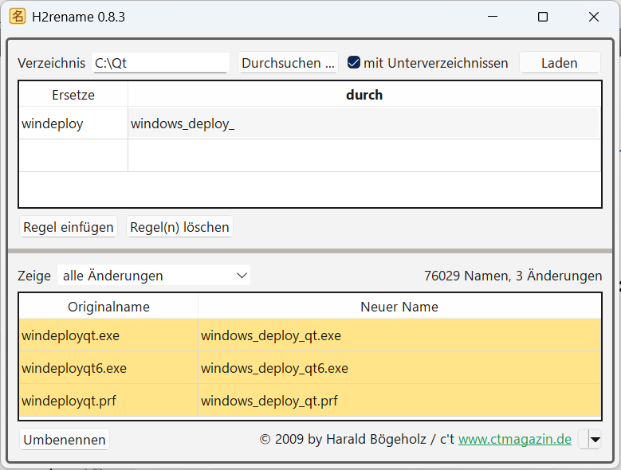

# H2rename
by Harald Boegeholz (bo@ct.de) / c't Magazin, [www.ct.de](https://www.heise.de/ct)

**H2rename** is a batch renaming program for files and directories. It
DOES NOT support regular expressions. Its strength is recognizing
special characters like umlauts that have been broken by transfering
files between, e.g., Windows and Linux. In this case H2rename will
automatically suggest renaming rules to fix them.

This program served as an example in an **article about Qt programming**
published in **c't 15/2009, p. 186**.

[https://www.heise.de/select/ct/archiv/2009/15/seite-186]()

Current binaries (Version 0.8.3) for Windows can be
downloaded from the [Release Page](https://github.com/Xonical/h2rename/releases/tag/Release)

Binaries (Version 0.8.1) for Windows, Mac OS and Linux (probably outdated) can be
downloaded from [https://www.heise.de/hintergrund/H2rename-Dateien-und-Verzeichnisse-umbenennen-292168.html]()

Ported from Qt4 to Qt5 (2023, Version 0.8.2) by ["Various FLOSS"](https://gitlab.com/various-floss/various-open-source-projekts/h2rename). Ported from Qt5 to Qt6 (2026) and set the
new release version to 0.8.3 by myself.

##### H2rename in Action
